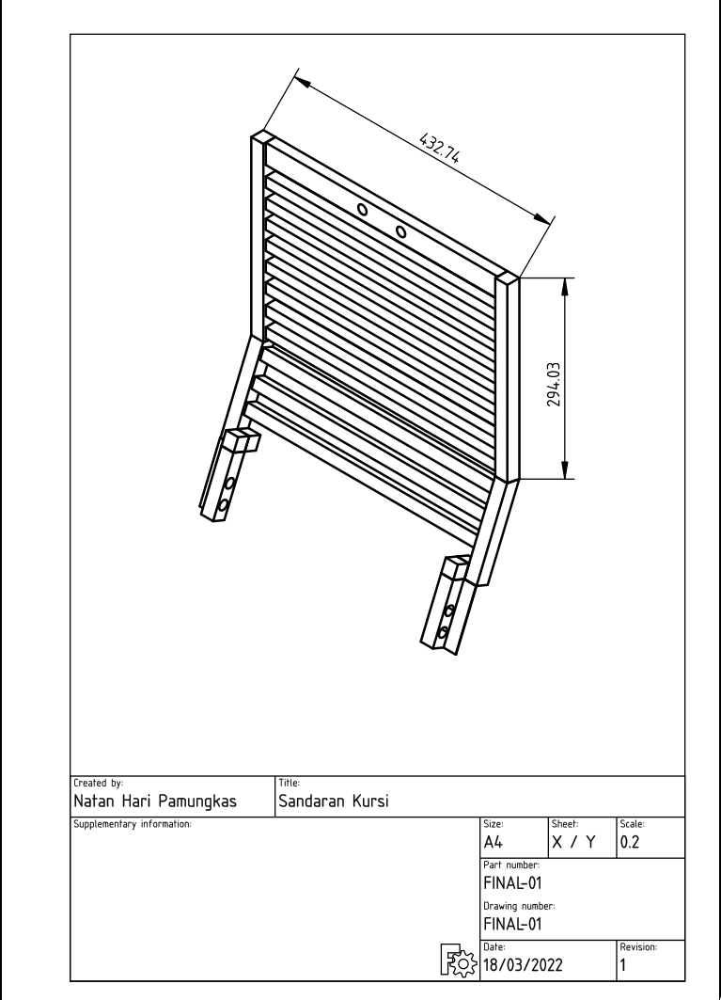

# Seat Back Design

[FreeCAD](https://github.com/FreeCAD/FreeCAD) design to replace my broken seat back. 

## Versioning
This project uses [ReZipDoc](https://github.com/hoijui/ReZipDoc) to keep track of the diffs. (I'm not sure how to use this though).
